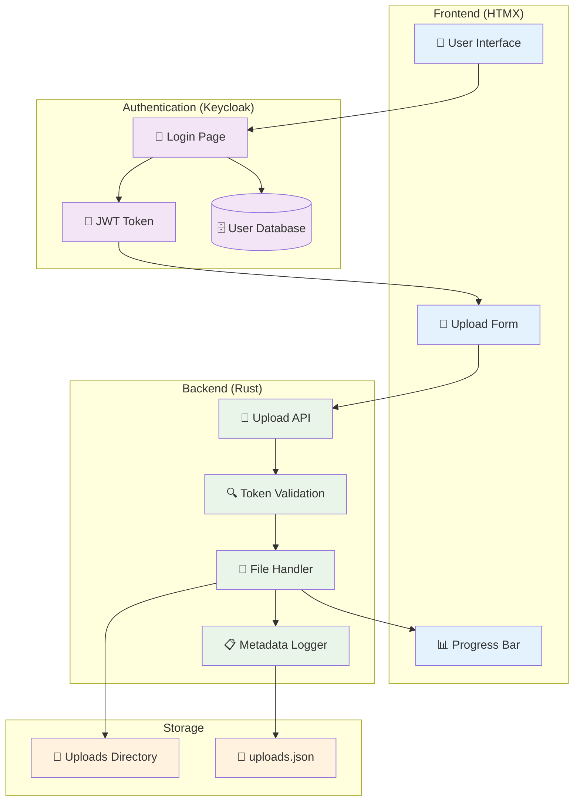
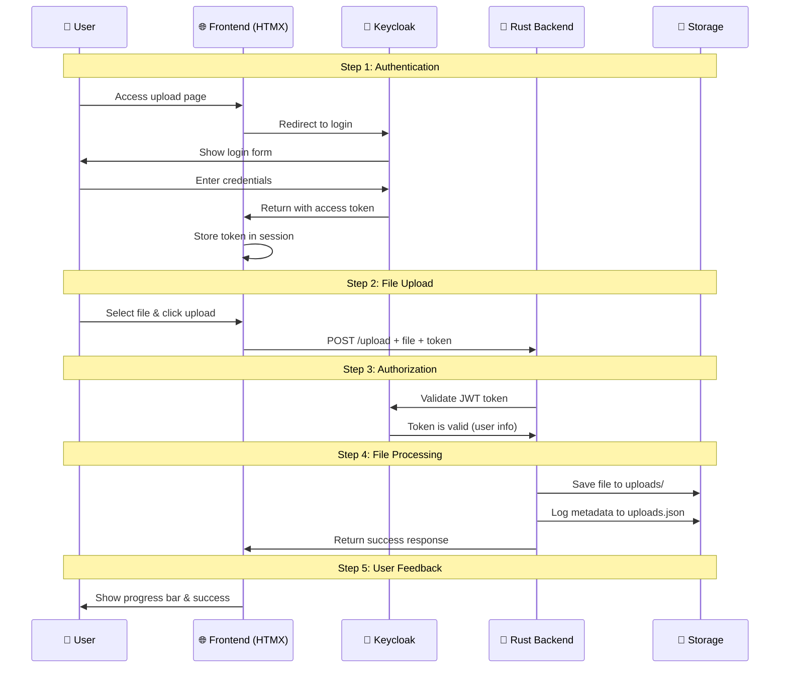
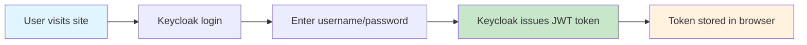
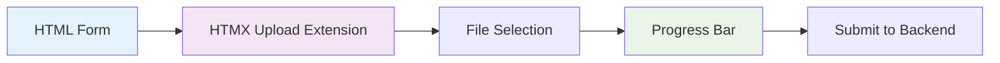
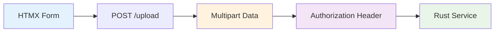
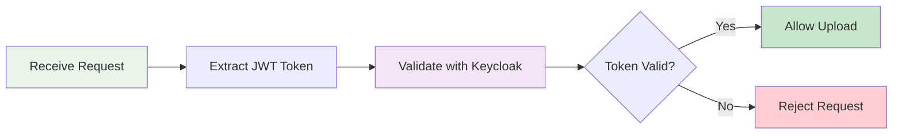
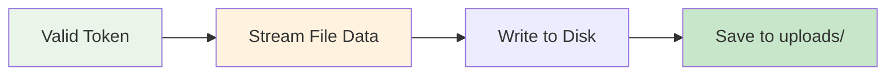
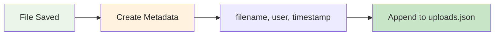
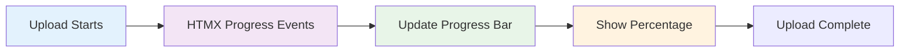
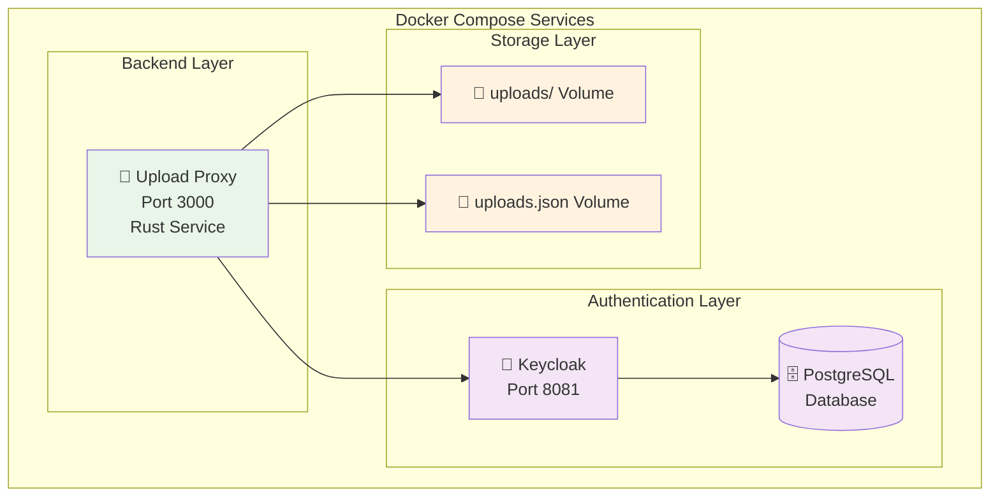

# File Upload System - Assignment Requirements & Flow Documentation

## 📋 Assignment Overview

**Project Goal**: Build a secure file upload system using modern web technologies where authenticated users can upload files to a local directory with metadata logging.

**Required Technologies**:
- **HTMX**: Modern JavaScript library for dynamic web interfaces
- **Rust**: Systems programming language for the backend service
- **OAuth2**: Standard protocol for secure authentication
- **Keycloak**: Identity and access management server (running in Docker)

## 🔍 Understanding the Assignment Terms

### What is HTMX?
HTMX is a modern JavaScript library that allows you to create dynamic web pages without writing complex JavaScript. It lets you:
- Send requests to servers without page reloads
- Update parts of the page dynamically
- Handle file uploads with progress bars
- Create interactive forms easily

### What is Rust?
Rust is a systems programming language that's:
- **Fast**: As fast as C/C++
- **Safe**: Prevents common programming errors
- **Modern**: Has excellent tooling and package management
- **Perfect for web services**: Great for building APIs

### What is OAuth2?
OAuth2 is a security standard that:
- Allows users to log in without sharing passwords
- Uses tokens instead of passwords for authentication
- Is widely used by Google, Facebook, GitHub, etc.
- Provides secure access to protected resources

### What is Keycloak?
Keycloak is an open-source identity management server that:
- Handles user authentication and authorization
- Supports OAuth2 and OpenID Connect
- Manages user accounts and passwords
- Issues secure JWT tokens

## 🏗️ System Architecture



## 🔄 Complete User Flow



## 🎯 Assignment Requirements Breakdown

### 1. **User Authentication** ✅


**What happens**: Before uploading, users must log in through Keycloak, which gives them a special token (JWT) that proves they're authenticated.

### 2. **Frontend Form** ✅


**What happens**: Simple HTML form uses HTMX to handle file uploads with real-time progress updates.

### 3. **Backend Request** ✅


**What happens**: HTMX sends the file data and user's authentication token to the Rust backend service.

### 4. **Authorization Check** ✅


**What happens**: Rust service checks if the user's token is valid by asking Keycloak to verify it.

### 5. **File Processing** ✅


**What happens**: Once authorized, the Rust service streams the file data and saves it to the local `uploads/` directory.

### 6. **Metadata Logging** ✅


**What happens**: After successful upload, the system logs metadata (filename, user, timestamp) to `uploads.json`.

### 7. **Progress Bar** ✅


**What happens**: HTMX provides real-time progress updates that show the user how much of their file has been uploaded.

## 🐳 Docker Compose Services



## 📁 Project Structure

```
file-uploader/
├── 📄 docker-compose.yml          # 🐳 Service orchestration
├── 📁 frontend/                   # 🌐 HTMX frontend
│   ├── 📄 index.html             # 🔐 Login page
│   ├── 📄 upload.html            # 📝 Upload interface
│   ├── 📄 config.js              # ⚙️ Configuration
│   └── 📄 server.py              # 🐍 Development server
├── 📁 upload-proxy/              # 🦀 Rust backend
│   ├── 📄 Cargo.toml            # 📦 Dependencies
│   ├── 📄 Dockerfile            # 🐳 Container build
│   └── 📁 src/
│       ├── 📄 main.rs           # 🚀 Service entry point
│       ├── 📄 auth.rs           # 🔍 Token validation
│       ├── 📄 handlers.rs       # 📝 Request handlers
│       └── 📄 metadata.rs       # 📋 Metadata logging
├── 📁 keycloak/                  # 🔐 Authentication
│   └── 📄 realm-export.json     # ⚙️ Keycloak config
├── 📁 uploads/                   # 📂 File storage
├── 📄 uploads.json              # 📋 Upload metadata
└── 📄 README.md                 # 📖 Documentation
```

## 🚀 How to Run the Assignment

### 1. Start All Services
```bash
# Start Keycloak, PostgreSQL, and Rust backend
docker-compose up --build
```

### 2. Start Frontend Server
```bash
# In a new terminal
cd frontend
python3 server.py
```

### 3. Access the Application
- **Frontend**: http://localhost:8000
- **Keycloak Admin**: http://localhost:8081 (admin/admin)
- **Upload API**: http://localhost:3000

### 4. Test the System
1. Go to http://localhost:8000
2. Click "Login with Keycloak"
3. Use test credentials: `testuser` / `testpass`
4. Select a file and upload
5. Watch the progress bar and success message

## 🔧 Technical Implementation Details

### Frontend (HTMX)
- **File**: `frontend/upload.html`
- **Features**: 
  - HTMX upload extension for file handling
  - Real-time progress bars
  - JWT token management
  - Modern responsive design

### Backend (Rust)
- **Framework**: Actix-web
- **Features**:
  - JWT token validation
  - Streaming file uploads
  - Multipart data handling
  - Metadata logging

### Authentication (Keycloak)
- **Protocol**: OAuth2 with PKCE
- **Database**: PostgreSQL
- **Features**:
  - User management
  - JWT token issuance
  - Public key endpoint (JWKS)

## 📊 Data Flow Summary

1. **User Authentication** → Keycloak issues JWT token
2. **File Selection** → HTMX form with progress tracking
3. **Upload Request** → Rust service with token validation
4. **File Processing** → Stream to disk in uploads/
5. **Metadata Logging** → Append to uploads.json
6. **User Feedback** → Progress bar and success message

## ✅ Assignment Compliance Checklist

- [x] **HTMX**: Used for frontend with upload extension
- [x] **Rust**: Backend service with Actix-web
- [x] **OAuth2**: PKCE flow with Keycloak
- [x] **Keycloak (Docker)**: Containerized authentication
- [x] **User Authentication**: Required before upload
- [x] **File Upload**: Multipart streaming to disk
- [x] **Metadata Logging**: JSON format with filename, user, timestamp
- [x] **Progress Bar**: Real-time upload progress
- [x] **Docker Compose**: All services orchestrated

**🎉 This implementation fully satisfies all assignment requirements!**
