# File Uploader Project Flow Documentation

## System Flow Diagram

```mermaid
graph TB
    %% User and Frontend
    User[👤 User] --> Frontend[🌐 Frontend Interface]
    Frontend --> |Select File| FileSelection[📁 File Selection]
    
    %% Authentication Flow
    subgraph "Authentication Flow"
        Keycloak[🔐 Keycloak Server]
        DB[(🗄️ PostgreSQL)]
        Keycloak --> DB
        JWT[🎫 JWT Token]
        Keycloak --> JWT
    end
    
    %% Upload Proxy Service
    subgraph "Upload Proxy Service"
        TokenValidation[🔍 Token Validation]
        JWKS[JWKS Endpoint]
        FileProcessing[📝 File Processing]
        MetadataLog[📊 Metadata Logging]
        
        TokenValidation --> JWKS
        TokenValidation --> FileProcessing
        FileProcessing --> MetadataLog
    end
    
    %% Storage
    subgraph "Storage Layer"
        FileStorage[📂 File Storage<br/>./uploads/]
        MetadataStorage[📋 Metadata Storage<br/>uploads.json]
    end
    
    %% Flow Connections
    FileSelection --> |POST /upload<br/>+ JWT Token| TokenValidation
    JWT --> TokenValidation
    
    %% Validation Process
    TokenValidation --> |Valid Token| FileProcessing
    TokenValidation --> |Invalid Token| Error[❌ Error Response]
    
    %% File Processing
    FileProcessing --> FileStorage
    FileProcessing --> MetadataStorage
    
    %% Response
    FileProcessing --> Success[✅ Success Response]
    MetadataLog --> Success
    
    %% Error Handling
    TokenValidation --> |Validation Failed| Error
    FileProcessing --> |Processing Failed| Error
    
    %% Styling
    classDef userClass fill:#e1f5fe
    classDef serviceClass fill:#f3e5f5
    classDef storageClass fill:#e8f5e8
    classDef errorClass fill:#ffebee
    
    class User,Frontend,FileSelection userClass
    class Keycloak,TokenValidation,FileProcessing,MetadataLog serviceClass
    class FileStorage,MetadataStorage,DB storageClass
    class Error errorClass
    
    %% Legend
    subgraph "Legend"
        L1[👤 User Interface]
        L2[🔐 Authentication]
        L3[📝 Processing]
        L4[📂 Storage]
        L5[❌ Error Handling]
    end
```



## Detailed Component Flow


## Data Flow Architecture


## Security Flow

```mermaid
graph TD
    subgraph "Security Validation"
        JWT[🎫 JWT Token] --> Decode[🔓 Decode Token]
        Decode --> Signature[🔍 Verify Signature]
        Signature --> Expiry[⏰ Check Expiry]
        Expiry --> Audience[🎯 Validate Audience]
        Audience --> Issuer[🏢 Verify Issuer]
        
        Signature --> |Invalid| Reject[❌ Reject Request]
        Expiry --> |Expired| Reject
        Audience --> |Invalid| Reject
        Issuer --> |Invalid| Reject
        Issuer --> |Valid| Accept[✅ Accept Request]
    end
    
    subgraph "File Security"
        Accept --> FileValidation[📋 File Validation]
        FileValidation --> SafeStorage[🔒 Safe Storage]
        SafeStorage --> AuditLog[📊 Audit Logging]
    end
    
    subgraph "CORS Security"
        Origin[🌐 Origin Check]
        Method[📝 Method Validation]
        Headers[📋 Header Validation]
        
        Origin --> |Allowed| Method
        Method --> |POST| Headers
        Headers --> |Valid| Process[⚙️ Process Request]
    end
```



## Overview

This project implements a secure file upload system with Keycloak authentication. The system consists of three main components:

1. **Keycloak Authentication Server** - Handles user authentication and JWT token generation
2. **Upload Proxy Service** - A Rust-based API that validates tokens and processes file uploads
3. **Frontend** - A simple HTML interface for file uploads

## System Architecture

The project uses Docker Compose to orchestrate multiple services:

- **Keycloak** (Port 8080): Authentication and authorization server
- **PostgreSQL** (Port 5432): Database for Keycloak
- **Upload Proxy** (Port 3000): File upload API service
- **Frontend**: Static HTML served via any web server

## Authentication Flow

### 1. User Authentication
- Users authenticate through Keycloak using OAuth2/OpenID Connect
- Keycloak issues JWT tokens with user information and permissions
- The frontend includes a hardcoded JWT token for demonstration purposes

### 2. Token Validation
- The upload proxy validates JWT tokens using Keycloak's public keys
- Tokens are verified for:
  - Signature validity (RS256 algorithm)
  - Expiration time
  - Audience claims (`account`, `upload-client`)
  - Issuer verification

## File Upload Flow

### 1. Frontend Request
- User selects a file through the HTML interface
- Form submits to `http://10.153.115.29:3000/upload` with:
  - File data (multipart/form-data)
  - Authorization header with Bearer token

### 2. Upload Proxy Processing
- **Token Validation**: Extracts and validates the JWT token
- **User Extraction**: Extracts user information from validated token
- **File Processing**: 
  - Saves file to `./uploads/` directory
  - Generates unique filename if needed
- **Metadata Logging**: Records upload metadata to `uploads.json`

### 3. Response
- Returns success/error response to frontend
- Progress bar shows upload progress

## Data Storage

### File Storage
- Files are stored in the `./uploads/` directory
- Mounted as a volume in the upload-proxy container

### Metadata Storage
- Upload metadata is stored in `uploads.json`
- Includes: filename, user, timestamp
- Format: JSON array of upload records

## Security Features

### JWT Token Security
- RS256 algorithm for token signing
- Public key verification from Keycloak JWKS endpoint
- Audience validation to prevent token misuse
- Expiration time validation

### CORS Configuration
- Restricted origins: `http://10.153.115.29:8000`, `http://localhost:8000`
- Allowed methods: POST only
- Allowed headers: Authorization, Content-Type

### File Upload Security
- User authentication required for all uploads
- File metadata tracking for audit purposes
- Secure file handling with proper error management

## Environment Configuration

### Upload Proxy Environment Variables
- `KEYCLOAK_URL`: Keycloak server URL
- `CLIENT_ID`: OAuth client identifier
- `CLIENT_SECRET`: OAuth client secret

### Keycloak Configuration
- Admin credentials: admin/admin
- Database: PostgreSQL with persistent storage
- Realm: `upload-realm`
- Client: `upload-client`

## Error Handling

### Token Validation Errors
- Invalid signature
- Expired tokens
- Invalid audience
- Missing or malformed tokens

### File Upload Errors
- File system errors
- Invalid file data
- Network connectivity issues

## Monitoring and Logging

- Structured logging with log levels
- Request/response logging via Actix middleware
- Error tracking and reporting
- Upload progress tracking

## Deployment

The system is containerized using Docker Compose:

```bash
docker-compose up -d
```

This starts all services with proper networking and volume mounts.

## API Endpoints

### POST /upload
- **Purpose**: Upload files with authentication
- **Headers**: 
  - `Authorization: Bearer <jwt_token>`
  - `Content-Type: multipart/form-data`
- **Response**: Success/error message
- **Security**: Requires valid JWT token

## File Structure

```
file-uploader/
├── docker-compose.yml          # Service orchestration
├── frontend/
│   └── index.html             # Upload interface
├── keycloak/
│   └── realm-export.json      # Keycloak configuration
├── upload-proxy/
│   ├── Cargo.toml            # Rust dependencies
│   ├── Dockerfile            # Container build
│   └── src/main.rs           # Upload API service
├── uploads/                   # File storage directory
└── uploads.json              # Upload metadata
```

## Future Enhancements

- File type validation
- File size limits
- Virus scanning
- File compression
- User-specific upload quotas
- Real-time upload progress
- File sharing capabilities
